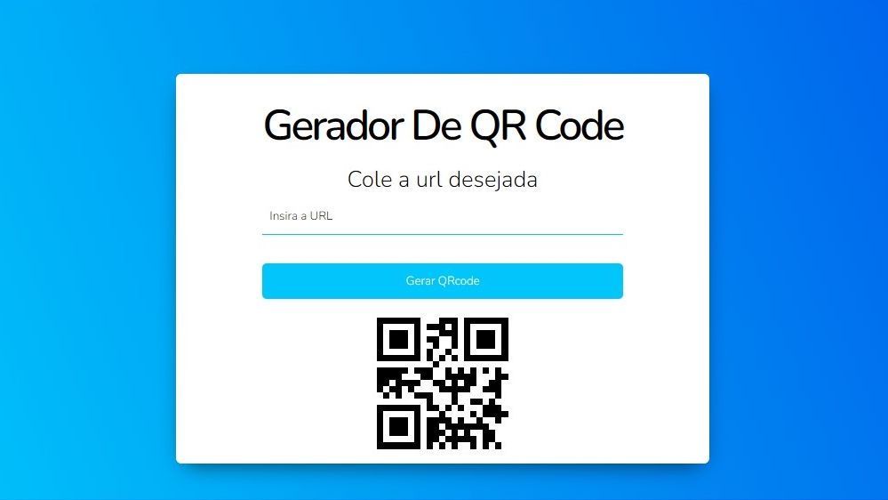

# QRCreator

O QRCreator é uma aplicação web que permite gerar QR codes de forma fácil e rápida. Com uma interface intuitiva e minimalista, os usuários podem inserir URLs ou texto personalizado e gerar QR codes correspondentes. Esses QR codes podem ser usados em uma variedade de contextos, como compartilhamento de informações, marketing digital ou até mesmo para diversão.

## Recursos
- Geração de QR codes a partir de URLs ou texto personalizado.
- Interface intuitiva e de fácil utilização.
- Visualização prévia dos QR codes gerados.
- Compartilhamento dos QR codes através de download ou link direto.
- Suporte a diferentes tamanhos e formatos de QR codes.

## Pré-requisitos
Antes de utilizar o QRCreator, certifique-se de ter os seguintes requisitos:
- Navegador web atualizado.
- Conexão com a internet.

## Como usar
1. Acesse a demonstração do QRCreator [aqui](https://dev-paixao.github.io/gerador-qrcode/).
2. Insira a URL desejada ou digite o texto personalizado no campo apropriado.
3. Clique no botão "Gerar" para criar o QR code correspondente.
4. Visualize o QR code gerado na área de pré-visualização.
5. Compartilhe o QR code através do botão de download ou copie o link direto.

## API do QRServer
O QRCreator utiliza a API do QRServer para a geração dos QR codes. Ao inserir uma URL ou texto, a aplicação faz uma requisição à API para obter o código correspondente.

## Contribuição
Contribuições são bem-vindas! Se você deseja melhorar o QRCreator, sinta-se à vontade para enviar pull requests ou relatar problemas encontrados.

## Licença
Este projeto está licenciado sob a licença [MIT](LICENSE).

## Créditos
O QRCreator foi desenvolvido por [dev_paixao] e é baseado em HTML, CSS e JavaScript.

---

## Preview

